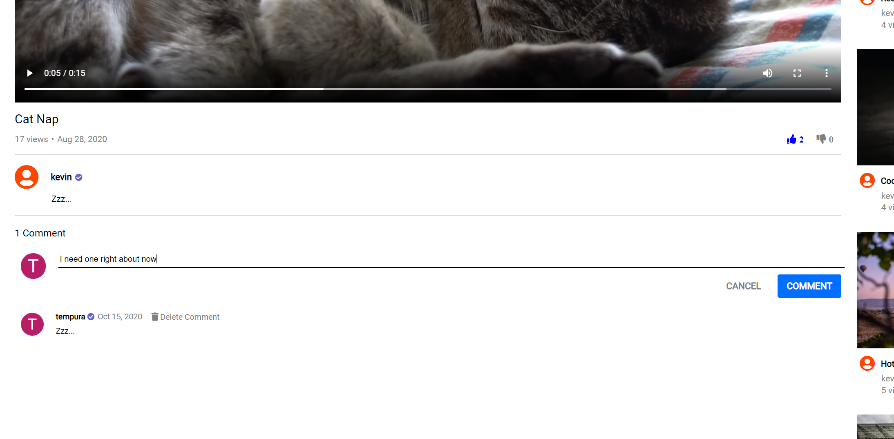
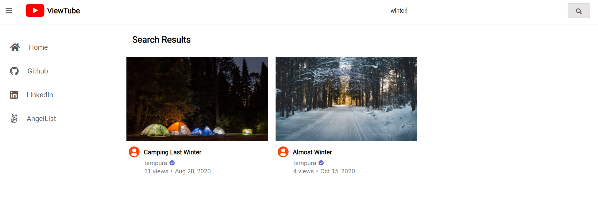

<h1 align="center">ViewTube</h1>

<div align="center">
   <a href="https://kb-viewtube.herokuapp.com/">
      
   </a>
</div>

<div align="center">
   <a href="https://kb-viewtube.herokuapp.com/">
      
   </a>
</div>

# Table of Contents
* <a href="#introduction">Introduction</a>
* <a href="#technologies">Technologies</a>
* <a href="#features">Features</a>
* <a href="#challenges">Challenges</a>
* <a href="#futurefeatures">Future Features</a>

<div id="introduction"></div>

# Introduction
[ViewTube](https://kb-viewtube.herokuapp.com/) is a video sharing platform for users to express and share themselves. Whether it’s through uploading a video, liking content, or voicing their opinions through comments, ViewTube promotes individuality and user interactions.

<div id="technologies"></div>

# Technologies
-	Rails
-	React
-	Redux
-	Amazon Web Services (S3)
-	Heroku

<div id="features"></div>

# Features
-	User sign up and log in authentication
-	Video upload, update, and delete
-  Video like or dislike
-  Video create or delete comment
-  Video search

<h3>Video like or dislike</h3>

```javascript
handleLikeVideo() {
        if (!this.props.currentUser) this.props.history.push('/login');

        if (this.props.userLike.liked === undefined) {
            this.props.createLike({
                video_id: this.props.video.id,
                liked: true
            }).then(() => this.props.fetchVideo(this.props.match.params.videoId))
        } else {
            if (this.props.userLike.liked === false) {
                this.props.updateLike({
                    id: this.props.userLike.id,
                    video_id: this.props.video.id,
                    liked: true
                }).then(() => this.props.fetchVideo(this.props.match.params.videoId))
            } else {
                this.props.deleteLike(this.props.userLike.id)
                    .then(() => this.props.fetchVideo(this.props.match.params.videoId))
            }
        }
    }
```

- The snippet above is the code block for liking a video (clicking the thumbs up). The first line of the function will push the user to log in if he or she hasn't already done so. The second if statement fires if the user is logged in and if the video isn't already liked or disliked; if that is the case, the "createLike" prop will initate and the video will be liked. However, if the video is already disliked, the "updateLike" prop will take action and will like the video instead of disliking it. In the case where the video is already liked and the user chooses to click on the thumbs up, the "deleteLike" prop will fire and the video will no longer be liked. The same logic is applied for disliking (clicking the thumbs down) a video.

<h3>Video comment</h3>



- A user can comment on any video as long as the user is logged in. The username and publish date will accompany the comment whenever a comment is created. Only the creator of the comment will have the ability to delete the comment.

<h3>Video search</h3>



- Users can search the library of videos via the search bar in the header. The search functionality is based on the videos title.

<div id="challenges"></div>

# Challenges
-	The implementation of user authentication through React-Redux was quite cumbersome. There are a lot of moving parts to keep track of who is logged in to who can have access to certain routes on the website. To start off, we would need a couple of reducers, one to identify if the user is logged in or logged out and two others to keep track of user sign up or sign in errors. Then, we would need to have asynchronous and synchronous action creators, along with API functions that make the actual AJAX requests. Thunk middleware is involved to handle the asynchronous actions. Furthermore, “Protected” (renders components if a user is logged in) and “Auth” (renders components if a user is logged out) routes are implemented along with bootstrapping.

<div id="futurefeatures"></div>

# Future Features
-	Ability to comment on a comment
-	Ability to like or dislike a comment
-	User profile page